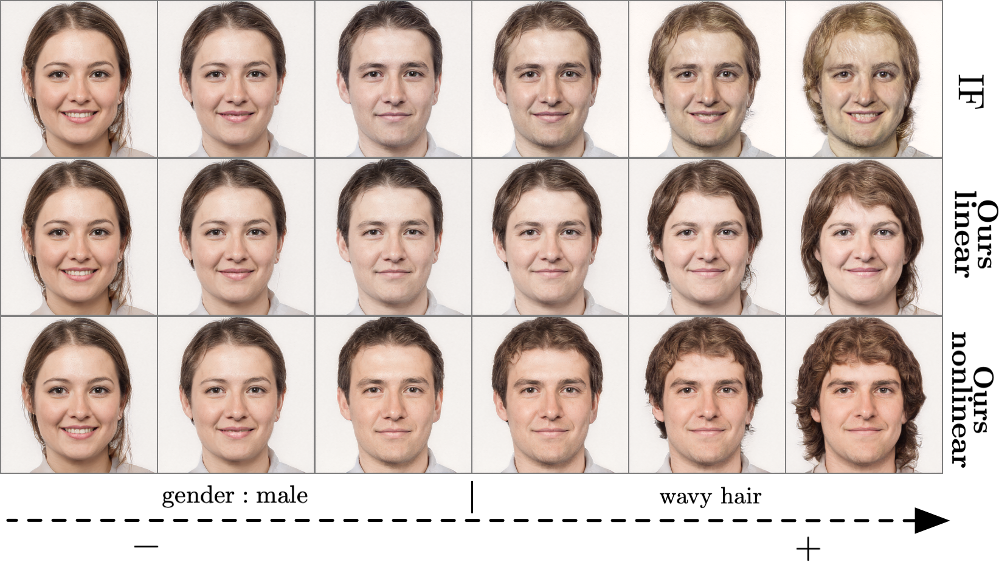

# On Nonlinear Latent Transformations for GAN-based Image Editing - PyTorch implementation

**On Nonlinear Latent Transformations for GAN-based Image Editing**
_Valentin Khrulkov, Leyla Mirvakhabova, Ivan Oseledets, Artem Babenko_

## Overview
We replace linear shifts commonly used for image editing with a flow of a trainable Neural ODE in the latent space.
```
w' = NN(w; \theta)
```
The RHS of this Neural ODE is trained end-to-end using pre-trained attribute regressors by enforcing
- change of the desired attribute;
- invariance of remaining attributes.
## Installation and usage
### Data
Data required to use the code is available at this [dropbox link](https://www.dropbox.com/sh/w2ox14aaftxdev6/AABOuqMVXGPEMRKuT1jJx2SYa) (2.5Gb).

| Path | Description
| :--- | :----------
| [data](https://www.dropbox.com/sh/w2ox14aaftxdev6/AABOuqMVXGPEMRKuT1jJx2SYa) | data hosted on Dropbox
| &ensp;&ensp;&boxvr;&nbsp; `models` | pretrained GAN models and attribute regressors
| &ensp;&ensp;&boxvr;&nbsp; `log` | pretrained nonlinear edits (Neural ODEs of depth 1) for a variety of attributes on _CUB_, _FFHQ_, _Places2_
| &ensp;&ensp;&boxvr;&nbsp; `data_to_rectify` | 100,000 precomputed pairs `(w, R[G[w]])`; i.e., style vectors and corresponding semantic attributes 
| &ensp;&ensp;&boxvr;&nbsp; `configs` | parameters of StyleGAN 2 generators for each dataset (`n_mlp`, `channel_width`, etc)
| &ensp;&ensp;&ensp;&ensp;&boxur;&nbsp; `inverses` | precomputed inverses (elements of W-plus) for sample `FFHQ` images


To download and unpack the data run `get_data.sh`.
### Training
We used `torch 1.7` for training; however, the code should work for lower versions as well.
An example training script to rectify all the attributes:
```console
CUDA_VISIBLE_DEVICES=0 python train_ode.py --dataset ffhq \
--nb-iter 5000 \
--alpha 8 \
--depth 1
```
For selected attributes:
```console
CUDA_VISIBLE_DEVICES=0 python train_ode.py --dataset ffhq \
--nb-iter 5000 \
--alpha 8 \
--dir 4 8 15 16 23 32 \
--depth 1
```
### Custom dataset
For training on a custom dataset, you have to provide
- Generator and attribute regressor weights
- a dictionary `{dataset}_all.pt` (stored in `data_to_rectify`). It has the form `{"ws": ws, "labels" : labels}`
with `ws` being a `torch.Tensor` of size N x 512 and `labels` is a `torch.Tensor` of size N x D, 
with D being the number of semantic factors. `labels` should be constructed by evaluating the corresponding attribute 
regressor on synthetic images `generator(ws[i])`. It is used to sample batches for training.


### Visualization
Please see `explore.ipynb` for example visualizations.
`lib.utils.py` contains a utility wrapper useful for building and loading the Neural ODE models (`FlowFactory`).

### Restoring from checkpoint
```python
import torch
from lib.utils import FlowFactory, LatentFlow
from torchdiffeq import odeint_adjoint as odeint
device = torch.device("cuda")
flow_factory = FlowFactory(dataset="ffhq", device=device)
odeblock = flow_factory._build_odeblock(depth=1)
# depth = -1 corresponds to a constant right hand side (w' = c)
# depth >= 1 corresponds to an MLP with depth layers
odeblock.load_state_dict(...)

# some style vector (generator.style(z))
w0 = ...

# You can directly call odeint
with torch.no_grad():
    odeint(odeblock.odefunc, w0, torch.FloatTensor([0, 1]).to(device))

# Or utilize the wrapper 
flow = LatentFlow(odefunc=odeblock.odefunc, device=device, name="Bald")
flow.flow(w=w0, t=1)

# To flow real images:
w = torch.load("inverses/actors.pt").to(device)
flow.flow(w, t=6, truncate_real=6)
# truncate_real specifies which portion of a W-plus vector to modify
# (e.g., first 6 our of 14 vectors)
```

A sample script to generate a movie is
```console
CUDA_VISIBLE_DEVICES=0 python make_movie.py --attribute Bald --dataset ffhq
```

## Examples
### _FFHQ_
**Bald** | **Goatee** | **Wavy_Hair** | **Arched_Eyebrows**
:-------:|:----------:|:------------:|:------------:
|||


**Bangs** | **Young** | **Blond_Hair** | **Chubby**
:-------:|:----------:|:------------:|:------------:
|||

### _Places2_
**lush** | **rugged** | **fog**
:-------:|:----------:|:------------:
||

## Citation
Coming soon.

## Credits
- [stylegan2-pytorch](https://github.com/rosinality/stylegan2-pytorch)
- [stylegan2-ada](https://github.com/NVlabs/stylegan2-ada)


